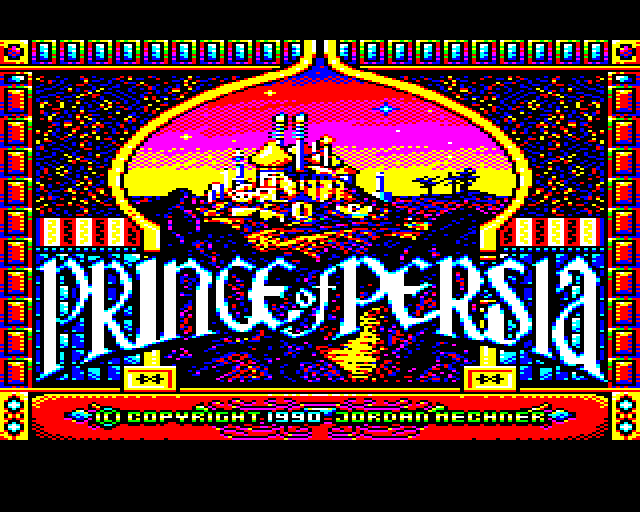
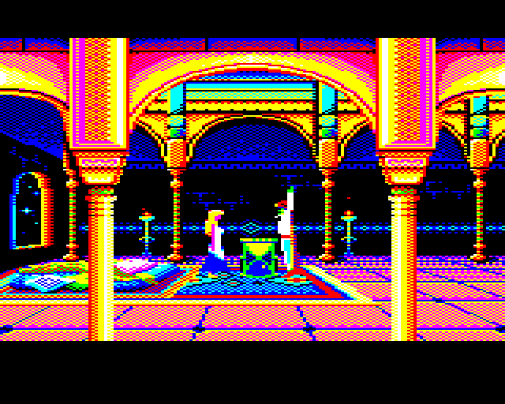
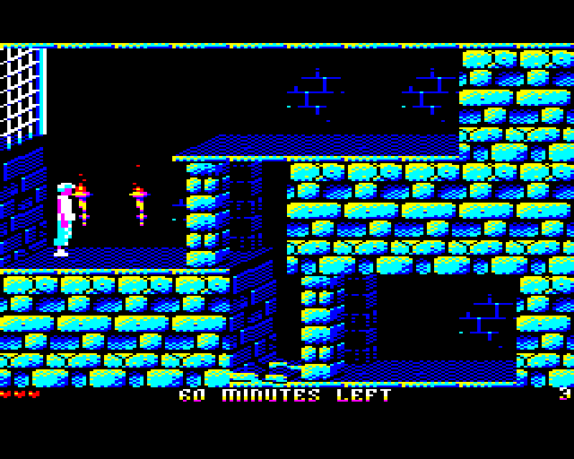
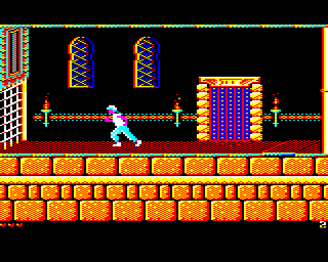

### **Introduction by Kieran**

After the original Apple II 6502 source code was recovered and uploaded to [GitHub](https://github.com/jmechner/Prince-of-Persia-Apple-II) by the author Jordan Mechner, I decided to take it upon myself to port this to the BBC Master computer, given that it shares the same 6502 CPU and 128K RAM. That was the theory at least. :) There are a lot of interesting technical challenges involved in this project and I believed it would be possible to create a faithful version of the game that features the best aspects of the BBC Micro.

See the thread on [Stardot forums](http://stardot.org.uk/forums/viewtopic.php?f=53&t=13079) for more information and a development blog of sorts.

### **About the Project**

*By Simon, in journo/observer mode*

**In the beginning...**

The project kicked off in April 2017. Kieran had mentioned his interest in the 6502 Apple source code for Prince Of Persia, and expressed some mad ideas to get it working on the BBC Micro, which seemed like crazy talk back then since the two machines are similar in some ways but very different in others.

Nontheless, Kieran went off and started to mess around with the source code, converting bits of the Apple sprite data and rendering it into MODE 1 on a BBC. That was pretty cool because the sprite format is kinda wierd on Apple, and it required some serious brain juice to figure out how to interpret it well on a machine that renders pixels in a different way. 

**Shiny things**

Soon enough, Kieran had cracked the animation tables too, so we enjoyed seeing how he'd managed to get the Kid running on the spot. Of course it was initially hacky and flickery, but it worked well enough. To be honest, at this stage, we still thought he was a bit mad to attempt this.

Next thing we knew, he had managed to not only get a bunch of the original source code compiling on the BBC, but also rendering levels. This is when we realised how serious he was! After that, Kieran hit a home run and really got some momentum. Suddenly, the Kid was in there too, you could control him. Then the active sprites and level features started working, then enemies, then more levels - yep, we said, Kieran's not messing about here.

But this is when it started getting trickier. Cramming all of the data and sprites and code into an 8-bit machine like the BBC is no mean feat and  availability of RAM quickly became a problem. Many clever tricks were needed (and I'm sure Kieran will share some technical insights on that topic sometime soon).

**Decisions, decisions**

After some deliberations, we realized it would only feasibly run on a 128Kb machine - the BBC Master. Ok fine.

Now at the same time, Kieran was battling to make the game render sprites fast enough to not be flickery, and also deciding if it was going to be high-resolution low-colour, or low-resolution high-colour. High-colour high-resolution would have been the dream ticket of course, but this is 8-bit, minimum RAM land we're talking about.

The good news was that because we were now only shooting for BBC Master, we could take advantage of the fact that this machine has shadow display RAM - which allows for double buffering of the screen. It turns out that was perfect for Prince of Persia, because it used a similar trick on the Apple II, and all the rendering code took advantage of this. When we first saw Kieran's double buffered version we were blown away - the rendering was now silky smooth and flicker free - it was awesome. As far as we can tell, there were very few games (if any) that used this technique BITD.

**Graphics**

The other decision that was made was to run with a more colourful 8-colour display, since the lower resolution helped reduce the amount of RAM needed for sprites, but would give us nice and colourful sprites. Enter - **John Blythe**, a wonderfully talented artist, who took all of the ruff conversions of the orginal converted Apple 8-bit pixel sprites and images and remastered every single one. Again, seeing the game with John's new artwork in took the game to a whole new level of amazeballs.

**Audio**

Next job, was the audio. The original game is as much a visual as an audio feast, with many different sound effects and music segments during the game. The Apple II has fairly pokey sound capabilities, but the BBC has a decent enough sound chip. We put in some music and sound playback code and initially used some of Matt Furniss' music into the game (pinched from the Sega Master System), but there were tunes missing, plus our talented musician **Inverse Phase** had other ideas. As a fan of POP anyway, he remastered all of the music from the original PC version of the game for the BBC's SN76489 sound chip. **Simon** nearly lost his mind trying to convert the music to 4Mhz chip tunes, but we overcame! We fixed it! We crammed it into memory! We got it working. We added sound effects. We added music. We added cutscene songs. At this point, it's now a game that sounds awesome too. But.. so much data, so little RAM...:) 

**Pack it in!!**

So although we were using almost every trick and byte in the machine we still kept running out of space to cram it all in. So we rallied, data was crunched, code was optimized, and somehow Kieran squeezed it all onto a single 200Kb disc image (ask him sometime about that time he wrote a PAK type file system in a couple of hours on the train home!!).

**Ship it!**

After a bit of a slog, finally, the finish line is visible. The entire original Apple II game source code has been fully ported. Now its time for... Testing the builds. Fixing the bugs. Nailing the snags. Yep, cramming for an Easter release deadline was almost like a real project! :)

So a massive thanks to all of the POP and Beeb community who helped support, test and feedback on this mad idea. It took a year, a labour of love, amazing commitments, but it turns out Kieran was right all along - it could indeed be done! Well done Kieran, John & Inverse Phase. A fantastic achievement.

Enjoy the game... ;)

 

## Game Controls

**Player Control Keys**

BBC Computer keyboard layout (your emulator layout may vary!):

* `Z` - Left
* `X` - Right
* `:` or `*` - Up / Jump (possibly  `quote` on your PC keyboard)
* `/` or `?` - Down / Crouch
* `]` - Forward Jump (possibly `#` on your PC keyboard)
* `RETURN` - Action / grab ledge / sneak / attack
* `T` - Show time remaining

**Helper Keys**

* `CTRL`+`K` - Redefine keys
* `CTRL`+`A` - Restart level
* `CTRL`+`R` - Return to titles
* `CTRL`+`G` - Save game to disc (must be write enabled)
* `CTRL`+`P` - Pause (`P` to step or any other key to continue)
* `CTRL`+`M` - Music on/off 
* `CTRL`+`S` - Sound on/off
* `CTRL`+`↑` - Volume up
* `CTRL`+`↓` - Volume down
* `CTRL`+`E` - Toggle easy guards on/off (reduce attack probability)

**Cheat Codes (Released game!)**

* `SKIP` - Next level
* `POP` - Cheat mode enabled (following codes then work)
* `KILL` - Kill guard on screen
* `BOOST` - Boost health meter (increase max energy)
* `REST` - Restore health to max
* `ZAP` - Zap guard to 1 health
* `EASY` - Easy guard mode
* `TINA` - Jump to end of game

