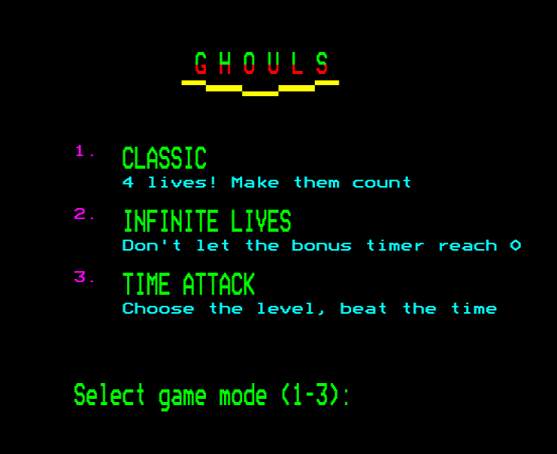
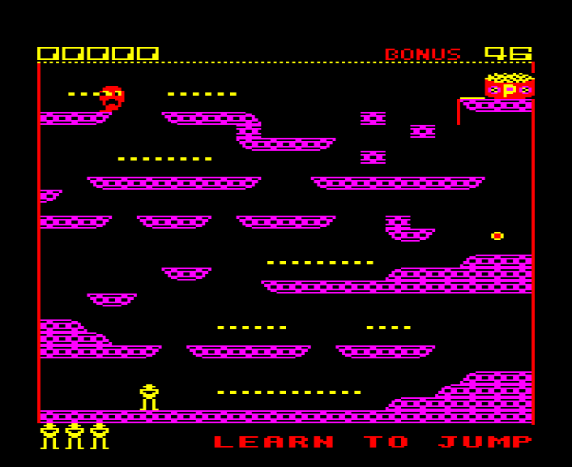
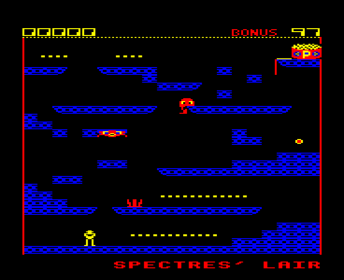
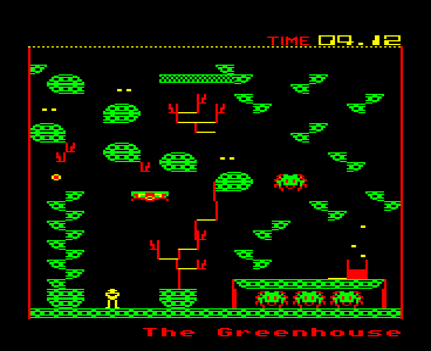
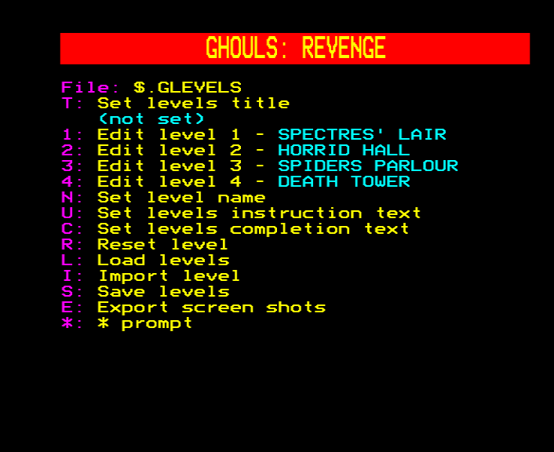
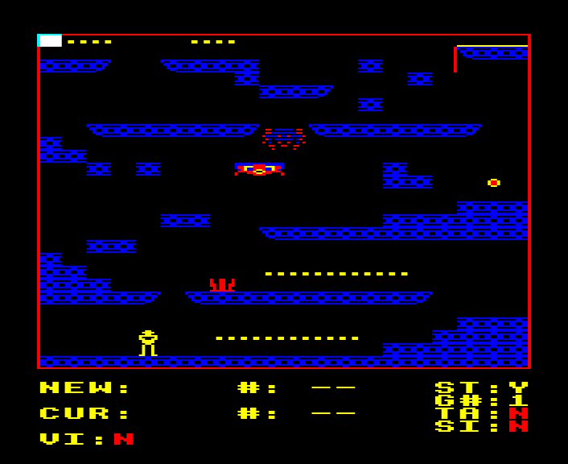
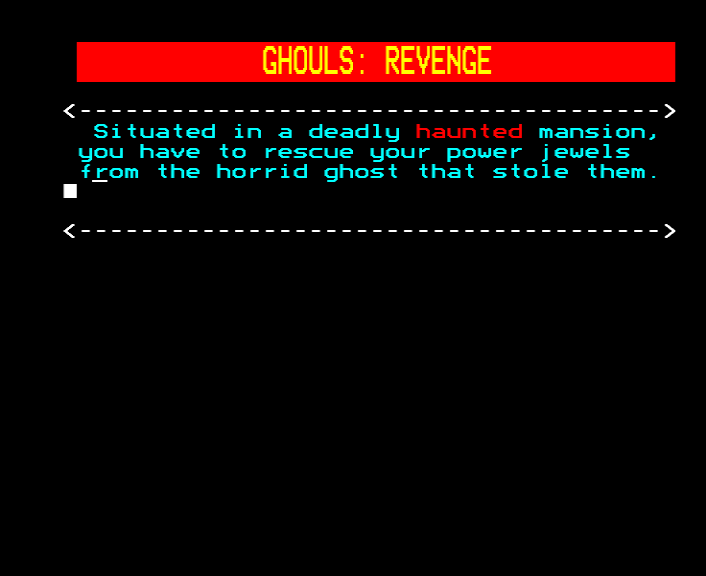

## **Ghouls: Revenge**

We've always loved Ghouls. What better way to celebrate its 40th
birthday than with an updated version?

Time to meet the ghost again! Revisit the deadly haunted mansion, then
try 60 additional new levels and 2 new game modes.

Just... don't expect this to be easy.

Once the ghost is defeated - or if you admit defeat yourself - use the
level editor to devise fresh torments.

-----

## **Instructions**

Full instructions are available on the project's GitHub page:

[https://github.com/tom-seddon/ghouls-revenge/blob/main/docs/ghouls-revenge.md](https://github.com/tom-seddon/ghouls-revenge/blob/main/docs/ghouls-revenge.md)

-----

## **Additional Downloads**

The download button link is for an 80 track DFS disk image.

The complete ZIP file includes both 40 and 80 track DFS disk images,
and ADFS S/M/L disk images:
[ghouls-revenge-v1.00.zip](../../content/ghouls-revenge-v1.00.zip)
