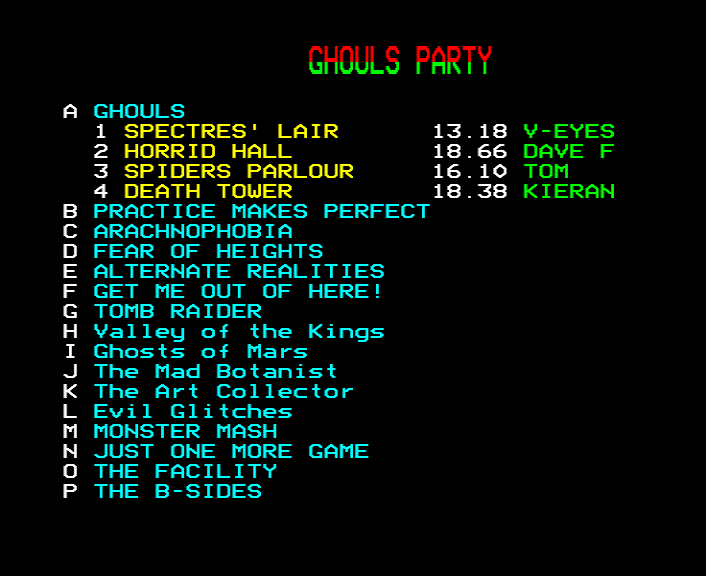

## **Ghouls: Revenge**

We've always loved Ghouls. What better way to celebrate its 40th
birthday than with an updated version?

Time to meet the ghost again! Revisit the deadly haunted mansion, then
try 60 additional new levels and 2 new game modes.

Just... don't expect this to be easy.

Once the ghost is defeated - or if you admit defeat yourself - use the
level editor to devise fresh torments.

-----

## **Ghouls Party**

_But that's not all!_ Ghouls: Revenge also includes Ghouls Party, a
completely fresh arcade-style take on the Ghouls experience.

The ghost is on holiday, and left you with the keys to the mansion
(and everywhere else): time for a Ghouls Party! Your choice of level,
race against the best time to get to the goal as quickly as possible.

Best times are stored on disk, so competition can be ongoing!

The files are mergeable, so you can share best times with others,
keeping the fastest. (And a copy of our own best times file is
included, if you fancy trying to beat us!)

-----

## **Instructions**

Full instructions are available on the project's GitHub page:

[https://github.com/tom-seddon/ghouls-revenge/blob/main/docs/ghouls-revenge.md](https://github.com/tom-seddon/ghouls-revenge/blob/main/docs/ghouls-revenge.md)

-----

## **Additional Downloads**

The download button link is for an 80 track DFS disk image for Ghouls:
Revenge

The complete ZIP file includes both Ghouls: Revenge and Ghouls Party.
Each one comes as DFS disk images (40 track and 80 track) and ADFS
disk images (S, M and L):
[ghouls-revenge-v1.10.zip](../../content/ghouls-revenge-v1.10.zip)
