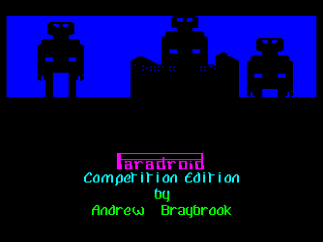
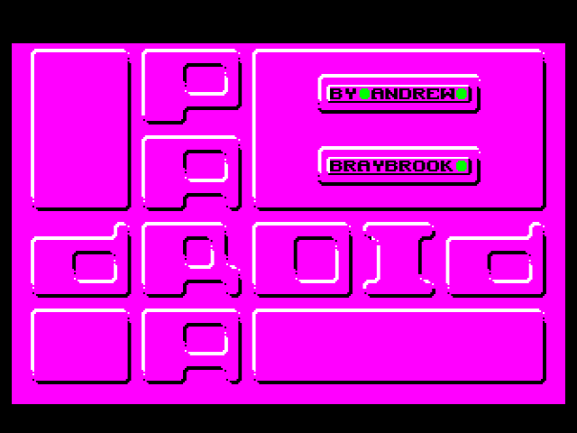
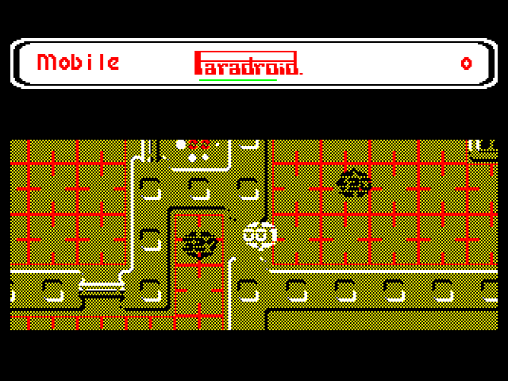
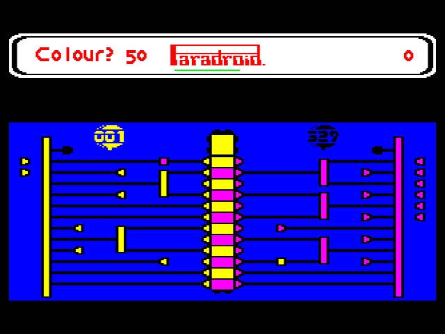
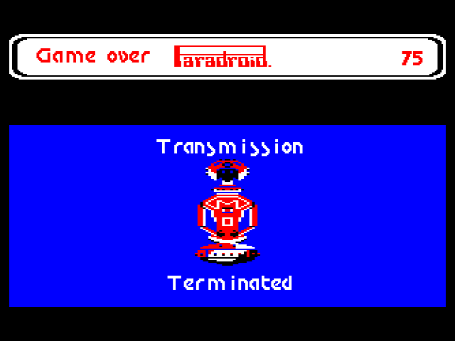

## **About**

[Paradroid](https://en.wikipedia.org/wiki/Paradroid) by [Andrew Braybrook](https://en.wikipedia.org/wiki/Andrew_Braybrook) is a legendary game originally released for the Commodore 64 in 1985. It was subsequently ported to 16/32-bit platforms but no other 8-bit machines. I was only introduced to the game in 1997 by my office-mate during my first job after university. We used to play the game on his C64 late at night whilst waiting for our project build to compile. One of the many fond memories of 90's video game development!

## **Port**

I've been threatening to port this game [since 2017](https://stardot.org.uk/forums/viewtopic.php?p=181590&hilit=paradroid#p181590) and made a couple of aborted attempts to look at the code, having obtained an assembly listing of Paradroid Competition Edition from a C64 forum member. My previous [game](https://bitshifters.github.io/posts/prods/bs-pop-beeb.html) [ports](https://bitshifters.github.io/posts/prods/bs-scr-beeb.html) took between 6 and 12 months and I just didn't have capacity to do another one at that scale. With the advent of AI coding agents in 2026, I decided to take another look at the project with the help of Claude Code.

Whilst I have wanted the port to exist for a long time, this was also very much an exploration into whether modern coding agents, like Claude, could write 6502 assembler and understand the BBC Micro architecture to the depth required for a sophisticated game. (This was very much not the case in 2025.) One month later, the port is complete yet not a single line of code has been written directly by me. The results are impressive, how I feel about that is better left to the [forum discussion](https://stardot.org.uk/forums/viewtopic.php?t=33437)!

A special mention goes out to [scarybeasts](https://scarybeastsecurity.blogspot.com/), who has hand-written an impressive 15kHz MOD player rendering the Paradroid-90 Amiga soundtrack at astonishing quality on the BBC Micro for our intro. Lastly, thanks to [Hexwab](https://github.com/hexwab) for providing additional hand-written optimisations that saved a substantial amount of bytes and cycles, extensive playtesting and pushing for the highest possible quality bar, particularly removing the disk load. Both go to show the limits of what AI can do - humans still have the edge!

## **How to Play**

See the [Paradroid Wiki](https://www.c64-wiki.com/wiki/Paradroid) or these Paradroid [strategy tips](https://home.hccnet.nl/r.helderman/enpara.htm) for help. Read this article on [why Paradroid was awesome](https://www.oldschoolgamermagazine.com/why-paradroid-for-the-c64-was-awesome/).

One main change to be aware of is that the game is keyboard only, so we've added a second 'action' button alongside 'fire'. Use the 'action' button to initiate droid transfer and to enter & exit lifts & consoles.

### Game Controls

**Player Control Keys**

BBC Computer keyboard layout (your emulator layout may vary!):

* `Z` - Left
* `X` - Right
* `K` - Up
* `M` - Right
* `L` - Fire
* `SPACE` - Action (initiate transfer, enter lift/console)
* `ESCAPE` - Quit

**Additional Keys**

* `Ctrl`+`P` - Pause game
* `Ctrl`+`R` - Redefine keys (whilst in briefing)
* `Ctrl`+`Q` - Toggle sound
* `Ctrl`+`Up` - Increase sound volume
* `Ctrl`+`Down` - Decrease sound volume

Note that this game requires 64K of sideways RAM and is Model B, B+ and Master compatible.